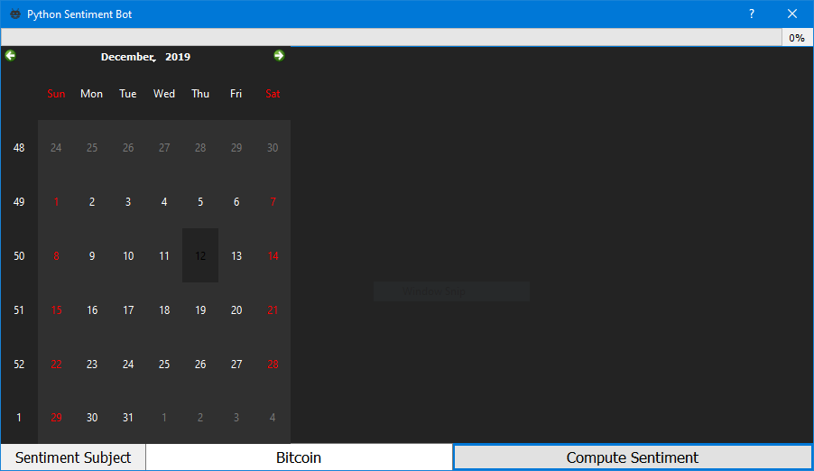
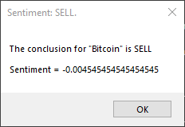

# Python Sentiment Analysis Bot
Python Sentiment Analysis Bot (Topics CS 3030 - Final Project)

---

### Proposal Idea:

The proposal idea is to create a basic sentiment analysis program that will parse variouus messages from webpages, such as news feeds, and comments throughout social media, as well cryptocurrency exchanges, in order to gauge the overall "vibe" of a specified cryptocurrency or stock market. Such analysis will be done by passing the retrieved text through a sentiment analyzer, to understand if the text is positive or negative.


Movements in various markets involving securities (e.g. cryptocurrencies) are heavily influenced by the underlying mood of the market participants trading and investing in those markets. For instance, if price is climbing rapidly there's a tendancy for the emotions of those involved in the market to be positive, whereas if the price is dropping rapidly the underlying emotions will likely be negative. Using this information from a trading standpoint, an invester can make better-informed decisions based upon how they interpret the results of the overall market sentiment. Some may want to enter a trade once the rest of the market is positive (or "bullish") whereas for others this will be interpreted as a sign to sell and exit the market (or "bearish").


> A sentiment score greater than zero means that the overall market sentiment is positive.
> 
> A sentiment score less than zero means that the overall market sentiment is negative.

---

### The implemented sentiment bots are as follows:
- Twitter
- BitcoinAverage
- Investing.com news feeds
- Google trends results
- The Google News feed
- The Yahoo News feed
- TradingView news feed
- Newslookup new feed

Ultimately this information can be used by a human trader, or can be incorporated into an algorithmic trading program that can make impartial buy/sell decisions on behalf of a human user. We may or may not do this part, the ultimate objective is just to create a tool that will be able to give useful information at-a-glance so anyone using it can be more aware of market conditions at any given point in time.

---

## System Requirements
The current requirements are as follows:
- A machine with Windows XP or greater, or Mac OS
- Python 3.0 or greater
  
    - To verify that this requirement is fulfilled, enter the following into the command line
    ```python3 --version```

The required Python libraries are as follows:
- requests v2.22.0
- beautifulsoup4 v4.8.1
- pandas v0.25.3
- preprocessor v1.1.3
- PySide2 v5.13.2
- python-dotenv v0.10.3
- textblob v0.15.3
- tweepy v3.8.0

---

## Instructions
After ensuring that the required prerequisites are fulfilled, typing the following lines will allow the application to run:

Download the repository
```
git clone https://github.com/bhewett-uccs/python-sentiment-bot.git
```
Navigate into the directory
```
cd python-sentiment-bot
```
Start the application
```
python3 Main.py
```
You will the be met with the following user interface:

The bar at the top is the progress bar, the group of controls at the bottom consist of the sentiment subject, allowing you to enter any topic to run the sentiment analysis on, and the "Compute Sentiment" button, which will begin the sentiment analysis. The progress of the sentiment analysis will be displayed within the box in the middle of the interface.

Please be patient while the sentiment analysis is working.

Upon completing the sentiment analysis, the results will be displayed.



The sentiment analysis changes over time, which is why it is important to check the results regularly.

---

If you have any questions, please feel free to ask. Have a great day.
